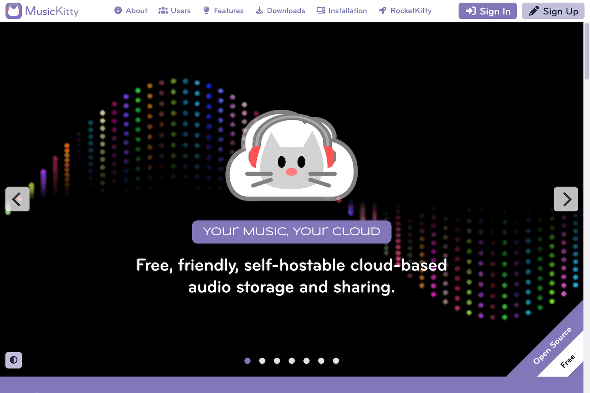

	

# MusicKitty

MusicKitty is a cloud-based audio storage, management, and sharing system. You love your music. Now you can love your music platform. Best of all, you can run it on your own server.

Welcome Screen

Desktop

## Features

- Manage your music - Organize your music.
- Share your music - Share music by link, shared folder, or email.
- Easy to install - with a one-step Docker installation.
- Easy to use - works like the desktop and mobile systems you already know.
- Customizable - by users and site administrators.
- Platform independent - desktop or mobile.
- Self-hostable - run a MusicKitty instance on your own server.

## Benefits

- Make your music easier to access and enjoy.
- Easily share your favorite music and artists with friends, family, or colleagues.
- Set up is quick and painless.
- Spend your time using instead of learning how to use the platform.
- Personalize your MusicKitty user experience.
- Run on any connected device.
- Take back control over your music from the tech giants.

## Live Demo

You can create an account and explore the features and benefits of the platform at [musickitty.org](https://musickitty.org).

## Installation

Please follow the instructions in [musickitty.org/#installation](https://musickitty.org/#installation) to install the software on your computer or web server.

## Instructions

See the [MusicKitty User Guide](https://musickitty.org/#help) for instructions on how to use the platform.

## License

Distributed under the <a href="https://en.wikipedia.org/wiki/MIT_License">MIT License</a> which allows unrestricted use of the software. See [LICENSE](LICENSE) for more information.

## Contact

mailto:admin@musickitty.org
